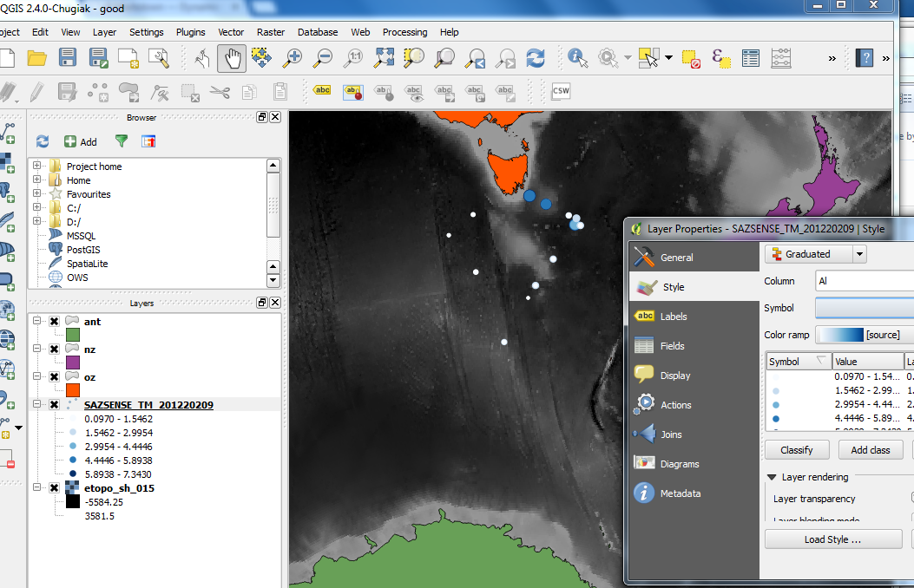
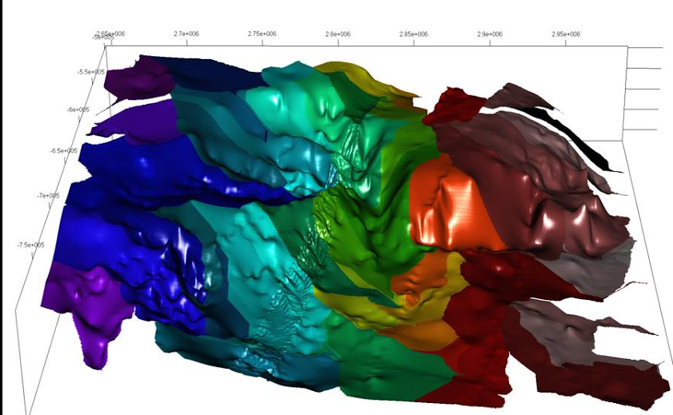

## Software and database engineer (2013 - current)

* Australian Antarctic Division, Department of Environment
* work with all kinds of spatial / temporal data and models
* primary software is R programming

* PhD in animal movement models, and integrating environmental data streams
* worked on various now-defunct projects
   + web mapping pre-Google maps (mapIQ)
   + online gambling (TOTE)
   + super-modern 4D GIS (Myriax)

## Ecosystem modelling

Data and programming support for Ecosystem Modelling

* coupling ecosystem and physical ocean models
* software pipelines with a variety of spatial formats and structures: 
   + polygons, transect lines, animal movement models, remote sensing data, physical models

Lots of juggling of different coordinate systems

## Sea ice data

```{r,echo = FALSE, message =FALSE}
library(raadtools)
ice <- readice(latest = TRUE)
library(graticule)
g <- graticule(seq(-180, 165, by = 15), seq(-85, -30, by = 15), xlim = c(-180, 180), proj = projection(ice))
plot(ice, axes = FALSE)
title(format(getZ(ice)))
plot(g, add = TRUE, col = rgb(0, 0, 0, 0.5), lty = 2)
glabs <- graticule_labels(c(-180, -90, 0, 90), c(-85, -70, -55, -40), 
                          xline = -70, yline = -60, proj = projection(ice))
text(glabs, lab = parse(text = glabs$lab))
```

## Ecosystem data

Data currency is crucial

* endless streams of scientific collection, remote sensing, model outputs
* remote sensing data library  - automatically kept up to date

Map projections are crucial

* daily sea ice maps
* model structures that traverse the dateline (polygons, transects, 3D meshes)
* characterization of shape and scale


## Ecosystem models

![Atlantis_polygons][id1]

[id1]: images/Atlantis_polygons.png "Atlantis polygons"


## Ocean physical models

![EddyEnergyROMS][id2]

[id2]: images/EddyEnergyROMS.png "EddyEnergyROMS"

##  Assessment of habitat change

![Assessment_chla][id3]

[id3]: images/Assessment_chla.png "Assessment_chla"

##  Assessment of habitat change

![Assessment_ice][id4]

[id4]: images/Assessment_ice.png "Assessment_ice"


```{r,eval=TRUE,echo=FALSE,message=FALSE}
library(sp)
library(maptools)
library(raster)
library(rgeos)
library(rgdal)
```

## Summary

- plotting data on a map
- controlling plot region and orientation
- there's more than one way to do it

- longlat maps
- projected maps
- 3D maps


## Raw data 
```{r}
f <- "SAZSENSE_TM_20120209.txt"
szt <- read.table(f, comment.char = "/", sep = "\t", header = TRUE)
summary(szt)
```

## Take me to the map
```{r}
plot(Lat ~ Lon, data = szt)
```

## "I just want a map of my data"
```{r,eval=TRUE}
library(maptools)
data(wrld_simpl)
plot(wrld_simpl)
points(Lat ~ Lon, data = szt)
```

## Context 1
```{r}
plot(wrld_simpl, xlim = range(szt$Lon) + c(-5, 5), 
                  ylim = range(szt$Lat) + c(-3, 3))
points(Lat ~ Lon, data = szt)
```

## Context 2

```{r}
plot(Lat ~ Lon, data = szt, xlim = range(szt$Lon) + c(-5, 5), 
     ylim = range(szt$Lat) + c(-12, 5), axes = FALSE)
plot(wrld_simpl, add = TRUE)
degAxis(1);degAxis(2);box()
```


## Map scales - aspect ratio
```{r,echo=FALSE}
op <- par(mfrow = c(2, 2), mar= par("mar")/2)
plot(Lat ~ Lon, data = szt)
usr <- par("usr")
text(mean(usr[1:2]), mean(usr[3:4]), lab = "default")
plot(Lat ~ Lon, data = szt,  asp = 1)
text(mean(usr[1:2]), mean(usr[3:4]), lab = "1:1")
plot(Lat ~ Lon, data = szt,  asp = 3)
text(mean(usr[1:2]), mean(usr[3:4]), lab = "3:1")
plot(Lat ~ Lon, data = szt,  asp = 1/cos(48 * pi/180))
text(mean(usr[1:2]), mean(usr[3:4]), lab = "1/cos(lat)")
par(op)
```

## Map scales - aspect ratio "default"
```{r,eval=FALSE}
plot(subset(wrld_simpl, NAME == "Australia"), asp = "")
```
```{r,echo=FALSE}
x <- c(134, -24)
plot(subset(wrld_simpl, NAME == "Australia"), asp = "")

degAxis(1)
degAxis(2)
box(col = "red")
text(x[1],x[2], lab = "default")
usr <- par("usr")
```

## Map scales - aspect ratio "iso"
```{r,eval=FALSE}
plot(subset(wrld_simpl, NAME == "Australia"), asp = 1)
```
```{r,echo=FALSE}
x <- c(134, -24)
plot(subset(wrld_simpl, NAME == "Australia"), asp = 1)
abline(v = 159 + 5/60, lty = 2, col = "grey")
box()
degAxis(1)
degAxis(2)
text(x[1],x[2], lab = "1:1")
##abline(v = usr[1:2], h = usr[3:4], col = "red")
rect(usr[1], usr[3], usr[2], usr[4], border = "red", lwd = 2)
```

## Map scales - aspect ratio "1/cos(lat)"
```{r,eval=FALSE}
plot(subset(wrld_simpl, NAME == "Australia"), asp = 1/cos(-30 * pi/180))
```
```{r,echo=FALSE}
x <- c(134, -24)
plot(subset(wrld_simpl, NAME == "Australia"), asp = 1/cos(-30 * pi/180))
box()
degAxis(1)
degAxis(2)
text(x[1],x[2], lab = "1/cos(lat)")
rect(usr[1], usr[3], usr[2], usr[4], border = "red", lwd = 2)
```

## xlim/ylim/asp aren't enough

```{r}
xx <- c(140, 155); yy <- c(-45, -20)
plot(wrld_simpl, xlim = xx, ylim = yy, asp = 1.5); axis(1);axis(2)
rect(xx[1], yy[1], xx[2], yy[2], border = "dodgerblue", lwd = 2)
```

## Control your plot 
```{r}
source("aspectplot.R") ## thanks Spoon
op <- aspectplot(xlim = xx, ylim = yy, asp = 1.5)
plot(wrld_simpl, add = TRUE); axis(1);axis(2)
rect(xx[1], yy[1], xx[2], yy[2], border = "dodgerblue", lwd = 2)
par(op)
```


```{r,echo=FALSE,eval=FALSE}
## Subset by data
library(maptools)
data(wrld_simpl)
cmatch <- c("Australia", "New Zealand", "Antarctica")
aanz <- subset(wrld_simpl, NAME %in% cmatch)
plot(aanz)
```


```{r,echo=FALSE,eval=FALSE}
## Subset by geometry
w0 <- getOption("warn")
options(warn = -1)
```

```{r,echo=FALSE,eval=FALSE}
library(raster)
expoly <- as(extent(100, 175, -78, -30), "SpatialPolygons")
library(rgeos)
aanzclip2 <- gIntersection(aanz, expoly, byid = TRUE)
plot(aanzclip2, col = c("red", "green", "blue"))
title("worst colour scheme ever")
```


```{r,echo=FALSE,eval=FALSE}
## What is "byid"?

gIntersection(aanz, expoly, byid = TRUE)
gIntersection(aanz, expoly, byid = FALSE)
```
```{r,echo=FALSE,eval=FALSE}
options(warn = w0)
```


```{r,echo=FALSE,eval=FALSE}
## "wrld_simpl" is not great

#The R *raster* has a getData function: 

library(raster)
x0 <- getData("GADM", country = "AUS", level = 0)  ## 6.8  Mb
plot(wrld_simpl, xlim = c(147.96, 148.02), 
     ylim = c(-43.26, -43.20), col = "grey")
plot(x0, add = TRUE); title("wrld_simpl vs GADM level 0")
```

```{r,echo=FALSE,eval=FALSE}
##x1 <- getData("GADM", country = "AUS", level = 1)  ## 7.5  Mb
##x2 <- getData("GADM", country = "AUS", level = 2)  ## 18.2 Mb
## does not seem worthwhile, at least at this location
## c(143.4, 149.14), ylim = c(-43.81, -39.45)
##plot(x0, xlim = c(147.99, 148.02), ylim = c(-43.26, -43.22), col = "grey", asp = 1)
##plot(x2, add = TRUE)
##title("GADM level 1")
```

 
```{r,eval=TRUE,echo=FALSE}
## Basic world outline

#Better than **wrld_simpl**, but juggling.
oz <- getData("GADM", country = "AUS", level = 0)  
nz <- getData("GADM", country = "NZ", level = 0)  
ant <- getData("GADM", country = "ATA", level = 0)
```
```{r,eval=FALSE,echo=FALSE}
plot(aanzclip2, col = c("red", "green", "blue"))
plot(oz, add = TRUE, col = "grey")
plot(nz, add = TRUE, col = "firebrick")
plot(ant, add = TRUE, col = "dodgerblue")
```

## Source your own

```{r,eval=FALSE}
library(raster)
help(getData)
library(rgdal)
help(readOGR)
```

GDAL can read vector data from **anywhere**, in R, QGIS, Python, others.  

This vector list (2014) keeps growing, the raster list much longer: 

**Vector drivers**: <sup><sub>ARCGEN, AVCBin, AVCE00, AeronavFAA, BNA, CSV, CartoDB, CouchDB, DGN, DXF, EDIGEO, ESRI Shapefile, ElasticSearch, GFT, GME, GML, GMT, GPKG, GPSBabel, GPSTrackMaker, GPX, GeoJSON, GeoRSS, Geoconcept, Geomedia, HTF, Idrisi, Interlis 1, Interlis 2, KML, MSSQLSpatial, MapInfo File, Memory, NAS, ODBC, ODS, OSM, OpenAir, OpenFileGDB, PCIDSK, PDF, PDS, PGDump, PGeo, PostgreSQL, REC, S57, SDTS, SEGUKOOA, SEGY, SQLite, SUA, SVG, SXF, TIGER, UK .NTF, VFK, VRT, WAsP, WFS, Walk, XLSX, XPlane</sub></sup>

```{r,echo=FALSE,eval=FALSE}
writeOGR(oz, "shp", "oz", "ESRI Shapefile")
writeOGR(nz, "shp", "nz", "ESRI Shapefile")
writeOGR(ant, "shp", "ant", "ESRI Shapefile")
```


```{r,eval=FALSE}
## Map scales - point size by data

scl <- function(x) (x - min(x, na.rm = TRUE))/diff(range(x, na.rm = TRUE))
plot(Lat ~ Lon, data = szt, cex = scl(sqrt(Al)) * 2 + 1)
```


```{r,eval=FALSE}
## Scales - point size by data
scl <- function(x) (x - min(x, na.rm = TRUE))/diff(range(x, na.rm = TRUE))
plot(Al ~ Depth, data = szt, cex = scl(sqrt(Al)) * 2 + 1)
```

## Final R map

```{r,eval=FALSE}
library(rgdal)

prj <- "+proj=laea +lat_0=-52 +lon_0=147 +x_0=0 +y_0=0 +ellps=WGS84 +towgs84=0,0,0,0,0,0,0 +units=m +no_defs"
oz2 <- spTransform(oz, CRS(prj))
nz2 <- spTransform(nz, CRS(prj))
ant2 <- spTransform(ant, CRS(prj))
xy <- project(cbind(szt$Lon, szt$Lat), prj)
ex <- 0.5 * union(extent(oz2), union(extent(nz2), extent(ant2)))
plot(ex, type = "n", asp = 1, axes = FALSE, xlab = "", ylab = "")
plot(oz2, add = TRUE, col = "grey", border = "transparent")
plot(nz2, add = TRUE, col = "firebrick", border = "transparent")
plot(ant2, add = TRUE, col = "dodgerblue", border = "transparent")
points(xy, cex = scl(sqrt(szt$Al)) * 1.5 + 1)
```
## Use a map projection

```{r,eval=TRUE,echo=FALSE}
op <- par(mar = rep(0, 4))
library(rgdal)
scl <- function(x) (x - min(x, na.rm = TRUE))/diff(range(x, na.rm = TRUE))
prj <- "+proj=laea +lat_0=-52 +lon_0=147 +x_0=0 +y_0=0 +ellps=WGS84 +towgs84=0,0,0,0,0,0,0 +units=m +no_defs"
oz2 <- spTransform(oz, CRS(prj))
nz2 <- spTransform(nz, CRS(prj))
ant2 <- spTransform(ant, CRS(prj))
xy <- project(cbind(szt$Lon, szt$Lat), prj)
ex <- 0.5 * union(extent(oz2), union(extent(nz2), extent(ant2)))
plot(ex, type = "n", asp = 1, axes = FALSE, xlab = "", ylab = "")
plot(oz2, add = TRUE, col = "grey", border = "transparent")
plot(nz2, add = TRUE, col = "firebrick", border = "transparent")
plot(ant2, add = TRUE, col = "dodgerblue", border = "transparent")
points(xy, cex = scl(sqrt(szt$Al)) * 1.5 + 1)
par(op)
```


## QGIS



## 3D stuff in R

OpenGL (and WebGL) provide accessible tools for visualization:

https://www.opengl.org/

GIS data needs massaging to use in OpenGL/WebGL: 

* normalize polygons into a database structure: vertices, rings, objects
* triangulate vertices with constraints (alignment to polygon edges)
* optionally - triangulate with internal vertices, a maximum triangle size

* convert images/rasters to quad mesh
* each pixel defined by its four corners 


## Why 3D? 

Extract from International Bathymetric Chart of the Southern Ocean
 
 


## Links

World outlines source: http://www.gadm.org/

QGIS: www.qgis.org

GDAL: www.gdal.org

OSGEO installer for Windows: http://trac.osgeo.org/osgeo4w/

Mesh structures from GIS data: https://github.com/mdsumner/gris

mdsumner@gmail.com

michael.sumner@aad.gov.au

Australian Antarctic Division