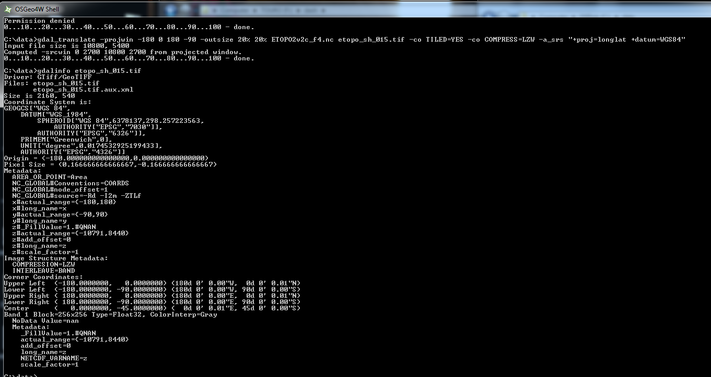
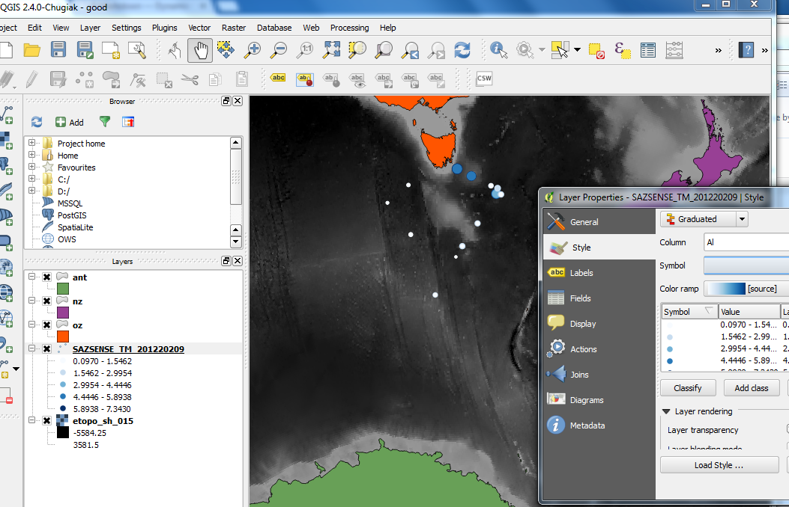

```{r,eval=TRUE,echo=FALSE,message=FALSE}
library(sp)
library(maptools)
library(raster)
library(rgeos)
library(rgdal)
```

## Why?

- gotchas abound
- there's more than one way to do it

## Summary

- plotting data on a map
- controlling plot region and orientation
- get better map data
- scaling plots by data value
- GDAL raster manipulation
- build the same map in QGIS

## Raw data 
```{r}
f <- "SAZSENSE_TM_20120209.txt"
szt <- read.table(f, comment.char = "/", sep = "\t", header = TRUE)
summary(szt)
```

## Take me to the map
```{r}
plot(Lat ~ Lon, data = szt)
```

## "I just want a map of my data"
```{r,eval=TRUE}
library(maptools)
data(wrld_simpl)
plot(wrld_simpl)
points(Lat ~ Lon, data = szt)
```

## Context 1
```{r}
plot(wrld_simpl, xlim = range(szt$Lon) + c(-5, 5), 
                  ylim = range(szt$Lat) + c(-3, 3))
points(Lat ~ Lon, data = szt)
```

## Context 2

```{r}
plot(Lat ~ Lon, data = szt, xlim = range(szt$Lon) + c(-5, 5), 
     ylim = range(szt$Lat) + c(-12, 5), axes = FALSE)
plot(wrld_simpl, add = TRUE)
degAxis(1);degAxis(2);box()
```


## Map scales - aspect ratio
```{r,echo=FALSE}
op <- par(mfrow = c(2, 2), mar= par("mar")/2)
plot(Lat ~ Lon, data = szt)
usr <- par("usr")
text(mean(usr[1:2]), mean(usr[3:4]), lab = "default")
plot(Lat ~ Lon, data = szt,  asp = 1)
text(mean(usr[1:2]), mean(usr[3:4]), lab = "1:1")
plot(Lat ~ Lon, data = szt,  asp = 3)
text(mean(usr[1:2]), mean(usr[3:4]), lab = "3:1")
plot(Lat ~ Lon, data = szt,  asp = 1/cos(48 * pi/180))
text(mean(usr[1:2]), mean(usr[3:4]), lab = "1/cos(lat)")
par(op)
```

## Map scales - aspect ratio "default"
```{r,eval=FALSE}
plot(subset(wrld_simpl, NAME == "Australia"), asp = "")
```
```{r,echo=FALSE}
x <- c(134, -24)
plot(subset(wrld_simpl, NAME == "Australia"), asp = "")

degAxis(1)
degAxis(2)
box(col = "red")
text(x[1],x[2], lab = "default")
usr <- par("usr")
```

## Map scales - aspect ratio "iso"
```{r,eval=FALSE}
plot(subset(wrld_simpl, NAME == "Australia"), asp = 1)
```
```{r,echo=FALSE}
x <- c(134, -24)
plot(subset(wrld_simpl, NAME == "Australia"), asp = 1)
abline(v = 159 + 5/60, lty = 2, col = "grey")
box()
degAxis(1)
degAxis(2)
text(x[1],x[2], lab = "1:1")
##abline(v = usr[1:2], h = usr[3:4], col = "red")
rect(usr[1], usr[3], usr[2], usr[4], border = "red", lwd = 2)
```

## Map scales - aspect ratio "1/cos(lat)"
```{r,eval=FALSE}
plot(subset(wrld_simpl, NAME == "Australia"), asp = 1/cos(-30 * pi/180))
```
```{r,echo=FALSE}
x <- c(134, -24)
plot(subset(wrld_simpl, NAME == "Australia"), asp = 1/cos(-30 * pi/180))
box()
degAxis(1)
degAxis(2)
text(x[1],x[2], lab = "1/cos(lat)")
rect(usr[1], usr[3], usr[2], usr[4], border = "red", lwd = 2)
```

## xlim/ylim/asp aren't enough

```{r}
xx <- c(140, 155); yy <- c(-45, -20)
plot(wrld_simpl, xlim = xx, ylim = yy, asp = 1.5); axis(1);axis(2)
rect(xx[1], yy[1], xx[2], yy[2], border = "dodgerblue", lwd = 2)
```

## Control your plot 
```{r}
source("aspectplot.R") ## thanks Spoon
op <- aspectplot(xlim = xx, ylim = yy, asp = 1.5)
plot(wrld_simpl, add = TRUE); axis(1);axis(2)
rect(xx[1], yy[1], xx[2], yy[2], border = "dodgerblue", lwd = 2)
par(op)
```

## Latitude scaling works up to a point
```{r}
plot(wrld_simpl, xlim = c(100, 160), ylim = c(-85, -40), asp = "")
axis(1);axis(2)
```

## 1/cos(lat) again
```{r}
op <- aspectplot(xlim = c(100, 160), ylim = c(-85, -40), asp = 1/cos(-60 * pi/180))
plot(wrld_simpl, add = TRUE); axis(1);axis(2)
par(op)
```

## Subset by data

```{r}
library(maptools)
data(wrld_simpl)
cmatch <- c("Australia", "New Zealand", "Antarctica")
aanz <- subset(wrld_simpl, NAME %in% cmatch)
plot(aanz)
```

## Subset by geometry
```{r,echo=FALSE}
w0 <- getOption("warn")
options(warn = -1)
```

```{r}
library(raster)
expoly <- as(extent(100, 175, -78, -30), "SpatialPolygons")
library(rgeos)
aanzclip2 <- gIntersection(aanz, expoly, byid = TRUE)
plot(aanzclip2, col = c("red", "green", "blue"))
title("worst colour scheme ever")
```

## What is "byid"?

```{r}
gIntersection(aanz, expoly, byid = TRUE)
gIntersection(aanz, expoly, byid = FALSE)
```
```{r,echo=FALSE}
options(warn = w0)
```

## "wrld_simpl" is not great

Raster has a booty function: 
```{r,cache=TRUE}
library(raster)
x0 <- getData("GADM", country = "AUS", level = 0)  ## 6.8  Mb
plot(wrld_simpl, xlim = c(147.96, 148.02), 
     ylim = c(-43.26, -43.20), col = "grey")
plot(x0, add = TRUE); title("wrld_simpl vs GADM level 0")
```

```{r,echo=FALSE,eval=FALSE}
##x1 <- getData("GADM", country = "AUS", level = 1)  ## 7.5  Mb
##x2 <- getData("GADM", country = "AUS", level = 2)  ## 18.2 Mb
## does not seem worthwhile, at least at this location
## c(143.4, 149.14), ylim = c(-43.81, -39.45)
##plot(x0, xlim = c(147.99, 148.02), ylim = c(-43.26, -43.22), col = "grey", asp = 1)
##plot(x2, add = TRUE)
##title("GADM level 1")
```

## Basic world outline

Better than **wrld_simpl**, but juggling. 
```{r}
oz <- getData("GADM", country = "AUS", level = 0)  
nz <- getData("GADM", country = "NZ", level = 0)  
ant <- getData("GADM", country = "ATA", level = 0)

```{r,eval=FALSE,echo=FALSE}
plot(aanzclip2, col = c("red", "green", "blue"))
plot(oz, add = TRUE, col = "grey")
plot(nz, add = TRUE, col = "firebrick")
plot(ant, add = TRUE, col = "dodgerblue")
```

## Source your own

```{r,eval=FALSE}
library(raster)
help(getData)
library(rgdal)
help(readOGR)
```

GDAL can read vector data from mostly **anywhere**, in R and QGIS.  

**Vector drivers**: <sup><sub>ARCGEN, AVCBin, AVCE00, AeronavFAA, BNA, CSV, CartoDB, CouchDB, DGN, DXF, EDIGEO, ESRI Shapefile, ElasticSearch, GFT, GME, GML, GMT, GPKG, GPSBabel, GPSTrackMaker, GPX, GeoJSON, GeoRSS, Geoconcept, Geomedia, HTF, Idrisi, Interlis 1, Interlis 2, KML, MSSQLSpatial, MapInfo File, Memory, NAS, ODBC, ODS, OSM, OpenAir, OpenFileGDB, PCIDSK, PDF, PDS, PGDump, PGeo, PostgreSQL, REC, S57, SDTS, SEGUKOOA, SEGY, SQLite, SUA, SVG, SXF, TIGER, UK .NTF, VFK, VRT, WAsP, WFS, Walk, XLSX, XPlane</sub></sup>

```{r,echo=FALSE,eval=FALSE}
writeOGR(oz, "shp", "oz", "ESRI Shapefile")
writeOGR(nz, "shp", "nz", "ESRI Shapefile")
writeOGR(ant, "shp", "ant", "ESRI Shapefile")
```

## Map scales - point size by data

```{r}
scl <- function(x) (x - min(x, na.rm = TRUE))/diff(range(x, na.rm = TRUE))
plot(Lat ~ Lon, data = szt, cex = scl(sqrt(Al)) * 2 + 1)
```

## Scales - point size by data

```{r}
plot(Al ~ Depth, data = szt, cex = scl(sqrt(Al)) * 2 + 1)
```

## Final R map

```{r,eval=FALSE}
library(rgdal)
prj <- "+proj=laea +lat_0=-52 +lon_0=147 +x_0=0 +y_0=0 +ellps=WGS84 +towgs84=0,0,0,0,0,0,0 +units=m +no_defs"
oz2 <- spTransform(oz, CRS(prj))
nz2 <- spTransform(nz, CRS(prj))
ant2 <- spTransform(ant, CRS(prj))
xy <- project(cbind(szt$Lon, szt$Lat), prj)
ex <- 0.5 * union(extent(oz2), union(extent(nz2), extent(ant2)))
plot(ex, type = "n", asp = 1, axes = FALSE, xlab = "", ylab = "")
plot(oz2, add = TRUE, col = "grey", border = "transparent")
plot(nz2, add = TRUE, col = "firebrick", border = "transparent")
plot(ant2, add = TRUE, col = "dodgerblue", border = "transparent")
points(xy, cex = scl(sqrt(szt$Al)) * 1.5 + 1)
```
## Final R map

```{r,eval=TRUE,echo=FALSE}
op <- par(mar = rep(0, 4))
library(rgdal)
prj <- "+proj=laea +lat_0=-52 +lon_0=147 +x_0=0 +y_0=0 +ellps=WGS84 +towgs84=0,0,0,0,0,0,0 +units=m +no_defs"
oz2 <- spTransform(oz, CRS(prj))
nz2 <- spTransform(nz, CRS(prj))
ant2 <- spTransform(ant, CRS(prj))
xy <- project(cbind(szt$Lon, szt$Lat), prj)
ex <- 0.5 * union(extent(oz2), union(extent(nz2), extent(ant2)))
plot(ex, type = "n", asp = 1, axes = FALSE, xlab = "", ylab = "")
plot(oz2, add = TRUE, col = "grey", border = "transparent")
plot(nz2, add = TRUE, col = "firebrick", border = "transparent")
plot(ant2, add = TRUE, col = "dodgerblue", border = "transparent")
points(xy, cex = scl(sqrt(szt$Al)) * 1.5 + 1)
par(op)
```

## QGIS / GDAL 

- Use GDAL to regrid Etopo2 for background in efficient format
- Import data and maps to QGIS
- Format data: data-scaled point colour and size
- Forget aspect ratio: use a map projection!  
- Print composer

## gdal_translate

```
gdal_translate ETOPO2v2c_f4.nc etopo_sh_015.tif \
 -a_srs "+proj=longlat +datum=WGS84" \ 
 -projwin -180 0 180 -90 \
 -outsize 20% 20%  \ 
 -co TILED=YES -co COMPRESS=LZW
```

- open gdalinfo screendump

## GDAL




## QGIS

- start QGIS

+proj=laea +lat_0=-52 +lon_0=147 +x_0=0 +y_0=0 +ellps=WGS84 +towgs84=0,0,0,0,0,0,0 +units=m +no_defs

## QGIS



## Links

World outlines source: http://www.gadm.org/

QGIS: www.qgis.org

GDAL: www.gdal.org

OSGEO installer for Windows: http://trac.osgeo.org/osgeo4w/

Better R data and graphics: dplyr and ggvis

## Future Topics
- GIS data structures
- Cropping / editing polygons
- Problems with Antarctica world shape
- Rasterizing polygons and lines
- Coercion between classes
- Interpolating from irregular data (Y~X, Depth~Lat, etc.)
- Tools for tracking data
- Calculating distance, distance-to-stuff
- Projections - sinusoidal, circumpolar, conformal conic, ...
- Drawing graticules (lon-lat lines)

mdsumner@gmail.com
Australian Antarctic Division

