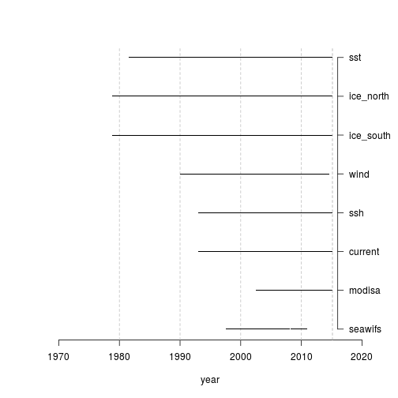
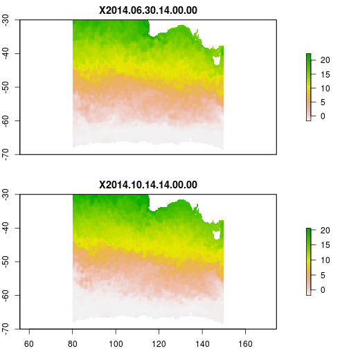
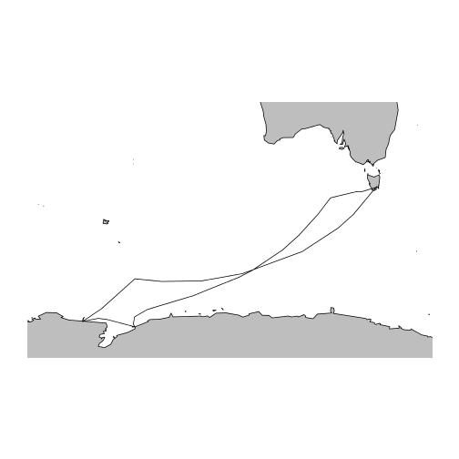
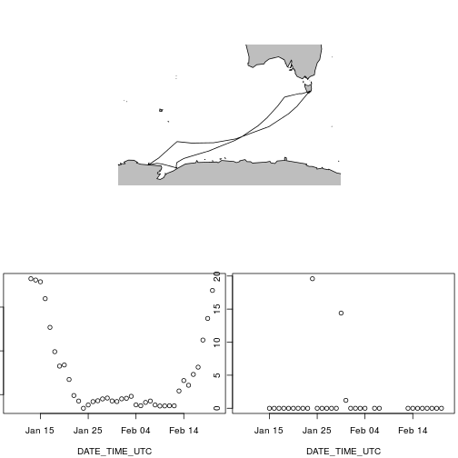

R tools for remote sensing data
========================================================
author: Michael Sumner
date: Feb 2015
css: myslides.css
Southern Ocean Ecosystem Change Program, Australian Antarctic Division

michael.sumner@aad.gov.au

![alt text][affil]
[affil]: affil.png "affil"

=========================================================
## Remote sensing data in Antarctic ecosystem models

![alt text][remotesensing]
[remotesensing]: bigpicturemotivation.png "remotesensing"


=========================================================
## R AAD tools


R tools for **easy** use of time-series remote-sensing oceanographic data.

- **raadtools** functions to read remote sensing data
- **raadsync** functions to build and maintain file collection
- (not on CRAN, need local set-up)

Built on standard tools - R, sp, rgdal, raster, GDAL, NetCDF, HDF. 


==========================================================
## Access to synoptic data sets

**raadtools** functions

- **readcurr**: ocean surface current vectors
- **readice**: sea ice concentration
- **readssh**: sea surface height anomaly
- **readsst**: sea surface temperature
- **readwind**: surface wind vectors
- **readchla**: phytoplankton via ocean colour
- **readtopo**: topographic data, bathymetry and elevation

System deployed on RStudio Server in the Nectar cloud. 

==========================================================
## Example 


```r
## read sea ice concentration data
library(raadtools)
dates <- c("2014-07-01", "2014-10-15", "2015-02-14")
ice <- readice(dates)

ice ## print summary of data object
```

```
class       : RasterBrick 
dimensions  : 332, 316, 104912, 3  (nrow, ncol, ncell, nlayers)
resolution  : 25000, 25000  (x, y)
extent      : -3950000, 3950000, -3950000, 4350000  (xmin, xmax, ymin, ymax)
coord. ref. : +proj=stere +lat_0=-90 +lat_ts=-70 +lon_0=0 +k=1 +x_0=0 +y_0=0 +a=6378273 +b=6356889.449 +units=m +no_defs 
data source : in memory
names       : nt_20140701_f17_nrt_s.bin, nt_20141015_f17_nrt_s.bin, nt_20150214_f17_nrt_s.bin 
min values  :                         0,                         0,                         0 
max values  :                       100,                       100,                       100 
time        : 2014-07-01, 2014-10-15, 2015-02-14 
```


```r
plot(ice)
```

![alt text][ice]
[ice]: ice.png "ice"


==========================================================
## Coverage in space

![alt text][spacecoverage]
[spacecoverage]: plot_zoom_png.png "spacecoverage"


==========================================================
## Coverage in time
 


==========================================================
## Flexible extraction  - spatial subset


```r
## spatial subset
dates <- c("2014-06-20", "2014-09-21", "2015-01-22")
x <- readsst(dates, xylim = extent(80, 150, -70, -30))
x
plot(x)
```

 


==========================================================
## Flexible extraction  - space-time overlay
 


```r
## extraction methods for "longitude", "latitude", "date-time"
voyage$sst <- extract(readsst, voyage[,1:3])
voyage$ice <- extract(readice, voyage[,1:3])
```

=================================================================
 

==========================================================
## Synchronizing file collection - (with Ben Raymond, AAD)

The **raadsync** package provides a configuration for file sources with various methods for
download (wget, ftp, custom)


```r
library(raadsync)
cf <- read_repo_config("/data/admin/local_raadsync_config.json")
cf$do_sync <- FALSE
cf$do_sync[grep("Daily remote-sensing KD490 from SeaWiFS. ", cf$description)] <- TRUE
sync_repo(cf)
```
```
> Skipping dataset (do_sync is FALSE): CERSAT SSM/I sea ice concentration
>  ...
> Checking config for dataset: Oceandata MODIS Aqua Level-3 binned daily KD490 ... done.
> Synchronizing dataset: Oceandata MODIS Aqua Level-3 binned daily KD490
> ...
> setting proxy variables ... done.
> building file list ... done.
> using custom handler "oceandata"
 ... 
>  decompressing: oceandata.sci.gsfc.nasa.gov/MODISA/L3BIN/2015/033/A2015033.L3b_DAY_KD490.main.bz2 ...  uncompressed file exists, skipping ... done
>  decompressing: oceandata.sci.gsfc.nasa.gov/MODISA/L3BIN/2015/034/A2015034.L3b_DAY_KD490.main.bz2 ...

```

==========================================================
## R AAD Tools

- raadtools and raadsync, R tools for data extraction
- Antarctic Division / Antarctic CRC
- Marine Predator labs IMAS
- beta tested by friends and colleagues

TODO: 
- streamline deployment of system
- Shiny pages!

Interested? 

- Michael.Sumner@aad.gov.au AAD
- Ben.Raymond@aad.gov.au Australian Antarctic Data Centre


https://github.com/AustralianAntarcticDataCentre/raadsync

https://github.com/mdsumner/raadtools


==========================================================
## Live demo


[http://mike@nectar.rdsi/]( http://localhost:9000/)


My personal Nectar machine
- connected to shared file system on big storage (RDSI)
- RAAD system installed in RStudio Server.  

  
